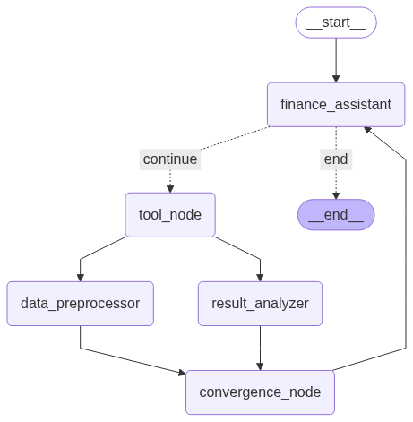

# LangGraph Fault Tolerance Demo

This project demonstrates **LangGraph's fault tolerance mechanism** using pending writes to handle partial failures in parallel execution workflows.

## What is Fault Tolerance with Pending Writes?

When multiple nodes run in parallel, some may succeed while others fail. LangGraph's fault tolerance ensures that:

- **Successful work is preserved** - Completed nodes' outputs are saved as "pending writes"
- **Only failed nodes retry** - Successful nodes don't re-execute on resume
- **Atomic state updates** - All writes are applied together using reducer functions
- **No lost progress** - Expensive operations (LLM calls, API requests) aren't repeated

## How This Demo Works

The demo simulates a financial analysis workflow with intentional failure:

```
START → finance_assistant → tool_execution → [data_preprocessor ✅, result_analyzer ❌] 
                    ↑                               ↓
                    └── convergence_node ← ─────────┘
                    ↓
                   END
```

### Execution Flow:

1. **Initial Request**: User asks to "Analyze top 3 contracts and multiply largest by π"

2. **Tool Execution**: LLM calls `get_finance_data` to retrieve contract information

3. **Parallel Processing**: Two nodes run simultaneously:
   - `data_preprocessor`: ✅ Always succeeds, writes preprocessing results
   - `result_analyzer`: ❌ Fails on first attempt (simulated)

4. **Fault Tolerance Activates**: 
   - LangGraph detects partial failure
   - Saves `data_preprocessor`'s successful write as "pending"
   - Creates checkpoint without losing work

5. **Resume & Recovery**:
   - Only `result_analyzer` re-runs (✅ succeeds this time)
   - Pending write from `data_preprocessor` is merged with new write
   - Workflow continues from convergence point

6. **Final Response**: LLM provides complete analysis without re-doing expensive work

## Key Technical Concepts

### Reducer Functions
```python
def merge_dicts(left: dict, right: dict) -> dict:
    """Handles concurrent writes to the same state key"""
    return {**left, **right}  # Merges dictionaries safely

class State(TypedDict):
    intermediate_results: Annotated[dict, merge_dicts]  # Uses reducer
```

### Checkpointing
- **SQLite-based persistence** preserves state across failures
- **Unique thread IDs** isolate different execution contexts
- **Pending writes** are stored separately until all parallel nodes complete

## Running the Demo

```bash
# set up venv and install dependencies
uv venv
uv pip install -r requirements.txt

# Set environment variables
OPENAI_API_KEY = ""

# Run the demonstration
python agent.py
```

## Real-World Applications

This pattern is valuable for:

- **Multi-agent systems**: Preserve work when some agents fail
- **API integrations**: Handle service timeouts gracefully  
- **Data pipelines**: Process large datasets in fault-tolerant chunks
- **LLM workflows**: Manage rate limits and model failures
- **Distributed processing**: Ensure consistency across parallel operations

## Architecture



*Figure 1: LangGraph fault tolerance workflow with parallel processing*