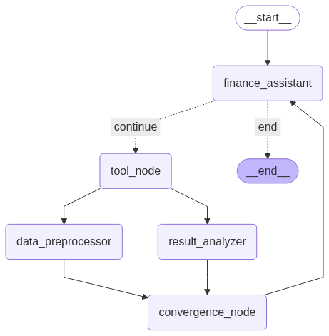
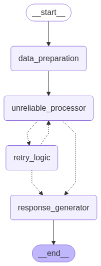

# LangGraph Fault Tolerance

This project demonstrates **LangGraph's fault tolerance mechanisms** through two patterns that handle different types of failures in LangGraph workflows.

## Overview

LangGraph provides robust fault tolerance through:
- **Pending writes** for partial failures in parallel execution
- **Retry logic with fallbacks** for unreliable operations
- **State checkpointing** to preserve progress across failures
- **Intelligent routing** to handle different failure scenarios

## Demo 1: Partial Failure with Pending Writes (`partial_failure_agent.py`)

Demonstrates how LangGraph handles **parallel execution failures** using pending writes.

### What This Solves
When multiple nodes run in parallel, some may succeed while others fail. LangGraph's fault tolerance ensures that:

- **Successful work is preserved** - Completed nodes' outputs are saved as "pending writes"
- **Only failed nodes retry** - Successful nodes don't re-execute on resume
- **Atomic state updates** - All writes are applied together using reducer functions
- **No lost progress** - Expensive operations (LLM calls, API requests) aren't repeated

### Agent Graph



*Figure 1: LangGraph fault tolerance workflow with parallel processing*

### Execution Sequence:

1. **Initial Request**: User asks to "Analyze top 3 contracts and multiply largest by π"
2. **Tool Execution**: LLM calls `get_finance_data` to retrieve contract information
3. **Parallel Processing**: Two nodes run simultaneously:
   - `data_preprocessor`: ✅ Always succeeds, writes preprocessing results
   - `result_analyzer`: ❌ Fails on first attempt (simulated)
4. **Fault Tolerance Activates**: 
   - LangGraph detects partial failure
   - Saves `data_preprocessor`'s successful write as "pending"
   - Creates checkpoint without losing work
5. **Resume & Recovery**:
   - Only `result_analyzer` re-runs (✅ succeeds this time)
   - Pending write from `data_preprocessor` is merged with new write
   - Workflow continues from convergence point
6. **Final Response**: LLM provides complete analysis without re-doing expensive work

## Demo 2: Retry Logic with Fallbacks (`retry_agent.py`)

Demonstrates **different retry strategies** for unreliable operations with progressive fallback approaches.

### What This Solves
Handles operations that fail intermittently (API timeouts, service unavailability, rate limits) with:

- **Progressive retry logic** - Multiple attempts with backoff
- **Fallback strategies** - Alternative approaches when retries fail
- **Graceful degradation** - Continue workflow even when processing fails
- **User communication** - Clear status updates about processing outcome

### Agent Graph



*Figure 2: LangGraph retry workflow with various retry strategies*

### Retry Strategy Tiers:

1. **Tier 1 (Retries 1-3)**: Direct retry of same operation
2. **Tier 2 (Retries 4-5)**: Fallback A - Simplify input and retry
3. **Tier 3 (Retry 6+)**: Fallback B - Skip processing, use default result

### Example Output Flow:
```
[ATTEMPT 1-3] Direct retries with complex input → FAIL
[ATTEMPT 4-5] Simplified input fallback → FAIL  
[ATTEMPT 6+] Default result fallback → SUCCESS (graceful degradation)
```

## Technical Implementation

### Reducer Functions (Demo 1)
```python
def merge_dicts(left: dict, right: dict) -> dict:
    """Handles concurrent writes to the same state key"""
    return {**left, **right}  # Merges dictionaries safely

class State(TypedDict):
    messages: Annotated[list[AnyMessage], add_messages] # Uses add_messages reducer
    ...
    intermediate_results: Annotated[dict, merge_dicts]  # Uses merge_dicts reducer
```

### Checkpointing
- **SQLite-based persistence** preserves state across failures
- **Unique thread IDs** isolate different execution contexts
- **Pending writes** stored separately until all parallel nodes complete

## Running the Demos

```bash
# Set up environment
uv venv
uv pip install -r requirements.txt

# Set environment variables
OPENAI_API_KEY=""

# Run partial failure demo
python partial_failure_agent.py

# Run retry logic demo  
python retry_agent.py
```

## Real-World Applications

### Partial Failure Pattern
- **Multi-agent systems**: Preserve work when some agents fail
- **Data pipelines**: Process large datasets in fault-tolerant chunks
- **API integrations**: Handle partial service outages
- **Distributed processing**: Ensure consistency across parallel operations

### Retry Logic Pattern
- **External API calls**: Handle rate limits and timeouts
- **LLM workflows**: Manage model failures and retries
- **Database operations**: Recover from connection issues
- **File processing**: Handle temporary I/O failures
